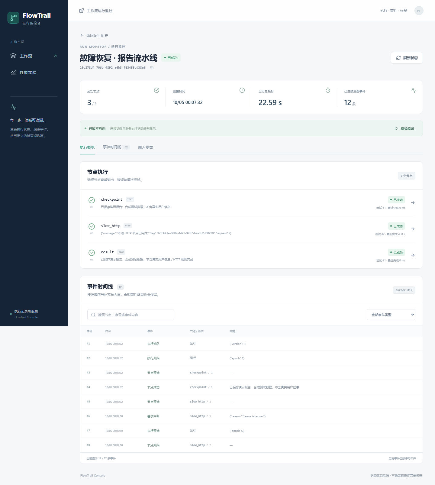

# FlowTrail Console · 运行监控台

基于 React＋TypeScript 的工作流监控台，复用 FlowTrail Java 后端，展示节点尝试、事件回放与真实进程故障后的恢复过程。

**跟踪节点尝试与执行事件，在 Java 进程故障和浏览器重连后回放持久化事件，并用同一批 10,000 条合成数据比较普通与虚拟事件列表。**

[English](README.md) | 中文 · [架构设计](docs/architecture.md) · [故障恢复演示](docs/recovery.md) · [性能实测](docs/performance.md)



## 功能

- 创建 TEXT 链、模拟 LLM 或故障恢复工作流，输入参数并查看该工作流最近 50 次运行。
- 查看节点状态、输出、错误、每次尝试及可搜索的事件时间线。
- 停止/继续监听、浏览器断网后补齐、Java 进程重启后回放持久化事件。
- 对符合条件的失败运行申请恢复，保留成功检查点和中断尝试记录。
- 在性能页面，用同一批 10,000 条合成事件对照普通列表与虚拟列表。

执行引擎来自 [FlowTrail Server](https://github.com/cloudwallker/flowtrail-server)。本项目新增 React 控制台、事件客户端、稳定快照契约、浏览器验收与演示证据；保留原许可证和署名，详见 [来源说明](docs/provenance.md)。

## 本地启动

需要 Node.js **24.15+**（22.x 系列最低 22.22.2）、Java **21**、Maven **3.8.5+**。将 Maven/npm 加入 PATH，设置 Java 21 的 `JAVA_HOME`，确保 5173、18081、18082 端口空闲。

```sh
npm ci --legacy-peer-deps
npm run dev
```

打开 **http://127.0.0.1:5173/workflows**，点击“创建工作流”。启动器会构建 Java 服务，启动文件型 H2 数据库、本地 HTTP 演示服务及 Vite 代理。TEXT 和模拟 LLM 无需外部账号或 API 密钥。开发数据保存于 `server/data/`，不会提交 Git。Ctrl+C 关闭启动器及其服务。

对接已有后端时，设置 `FLOWTRAIL_API_URL` 后执行 `npm run dev:ui`；默认后端地址为 `http://127.0.0.1:18081`。后端须支持本仓库的 `lastEventSeq`、`createdAt` 字段，详见 [契约说明](docs/architecture.md)。

## 生产构建

```sh
npm run build:all
java -jar server/target/flowtrail-server.jar
```

打开 **http://127.0.0.1:18081/workflows**。JAR 内包含前端生产资源，支持已定义页面的深链刷新，API 仍返回 JSON。TEXT 和模拟 LLM 可独立运行；HTTP 恢复模板还需执行 `node scripts/demo-service.mjs`，启动 18082 演示服务。

本版本用于可信本地环境，尚未提供认证、多租户、部署加固、后端任务取消或外部写入审批界面。“停止监听”只停止浏览器观察；`MANUAL_REVIEW` 仍需核查外部副作用，恢复操作不会绕过该保护。

## 自动化与验收

```sh
npm run typecheck
npm test
npm run build:all
npx playwright install chromium
npm run test:e2e
npm run benchmark
```

端到端测试使用独立 H2 数据目录，启动真实 Java 进程、4173 前端及 18081–18083 本地测试服务。端口需空闲。进程控制器只属于测试工具，不进入生产 API。测试覆盖真实提交、重复点击、幂等重试、旧响应、SSE 重复/缺口、断网补齐、超过 1,000 条持久化事件、强杀进程和检查点恢复；协议损坏场景使用明确的浏览器故障注入。CI 同时运行 MySQL 8.4 验证并保留浏览器报告。

[性能报告](docs/performance.md) 保存每种模式 5 次交替测量、环境与原始 JSON。数据为合成负载，不能等同生产吞吐。[故障恢复文档](docs/recovery.md) 提供录像、证据和复现步骤，[验收记录](docs/verification.md) 列出实际执行的检查及覆盖范围。

## 为什么这样管理状态

URL 存筛选；TanStack Query 存服务端快照；React Hook Form＋Zod 存输入；事件客户端存连续游标与尝试投影；组件状态存弹窗。REST 快照与事件片段分别管理，避免互相覆盖。

事件以 `(runId, seq)` 去重。只有校验通过、顺序连续且归并成功的事件才推进游标。发现缺口就从最后连续游标分页补齐。最新终态快照的水位追平后才停止，历史失败事件不会提前终止新尝试回放。更多取舍与实现入口见 [架构设计](docs/architecture.md)。

## 目录

| 目录 | 用途 |
|---|---|
| `src/pages`、`src/components` | 路由、表单、运行详情与虚拟时间线 |
| `src/queries.ts`、`src/form.ts` | REST 状态、快照水位归并、提交身份 |
| `src/events` | 事件投影、补齐、去重与连接清理 |
| `server` | 原 Java 执行引擎与监控契约补充 |
| `e2e`、`scripts` | 真实服务测试、故障注入与性能脚本 |
| `docs` | 设计说明、实测数据、演示与来源 |

MIT 许可；原后端许可保留于 `server/`，依赖说明见 [THIRD_PARTY_NOTICES.md](THIRD_PARTY_NOTICES.md)。
