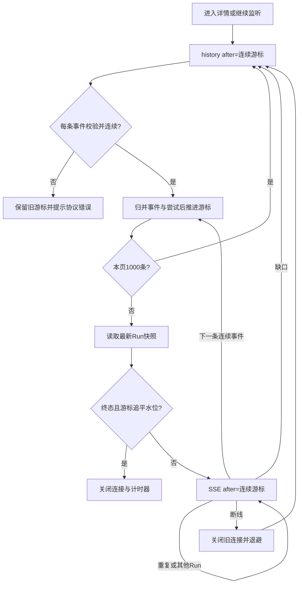

# 状态与事件一致性 / State and replay design

## 状态归属

| 状态 | 所有者 | 理由 |
|---|---|---|
| 页面、搜索、事件筛选、详情标签 | React Router URL | 深链、刷新、浏览器返回可恢复 |
| 工作流、运行列表、Run 快照、服务端操作 | TanStack Query | query key 包含资源 ID；fetch 消费 AbortSignal；缓存和错误边界一致 |
| 输入行、校验、提交状态 | React Hook Form＋Zod | 表单编辑独立于服务端快照，重复字段与必需输入可校验 |
| 连续事件、游标、模型输出尝试 | RunEventClient 外部 store | 一个订阅管理器控制连接，useSyncExternalStore 提供稳定快照 |
| 弹窗、选中节点、展开 | 组件状态 | 生命周期局部，不复制服务端业务状态 |

REST 不覆盖 LLM 事件片段。相同 Run 的 `lastEventSeq` 较低时，`mergeRunSnapshot` 保留已有快照；不同运行使用不同 key。已有工作流数据的后台刷新失败只显示提示，不卸载编辑表单或丢失未确认提交的请求键。页面离开会中止 GET 和组件持有的 mutation 请求；校验完成后若创建弹窗已离开，不再发出第二阶段创建 POST。订阅 generation 和连接身份还会拦截无法取消的旧回调。创建/恢复操作完成后先检查组件是否仍挂载，避免离页后的跳转或重启旧订阅。中止浏览器请求不保证已经到达后端的操作被撤销。

浏览器返回恢复原 URL 的筛选；页面中的显式“返回”链接进入对应的默认列表，深链没有原列表上下文时也可使用。详情标签支持方向键、Home/End 和单一 Tab 焦点入口。

## 后端快照契约

Run 新增 `lastEventSeq`，RunEvent 新增 `createdAt`；数据源是已有 `workflow_run.event_seq` 与 `run_event.created_at`，没有新的迁移。读取 Run、节点和 attempts 时在短事务中锁住运行根行，子节点和尝试也使用 `FOR UPDATE` 当前读。所有状态写入使用同一根行锁，从而把状态和水位读成稳定的同一版本；该读取加入已有写事务，不产生第二个独立版本。MySQL 的 REPEATABLE READ 事务可能已由先前普通 SELECT 建立旧快照，只有根行锁并不能刷新子查询的 read view；当前读修复这个幂等重试边界，回归测试先建立旧视图再让另一事务完成节点。

代价：监控读取与该运行的写入短暂串行，最近 50 条运行列表读完前保持锁。适合这个有界作品规模；高并发生产场景应测量锁等待并评估 MVCC 一致快照或版本化投影。测试在 H2 和真实 MySQL 8.4 上覆盖受控并发与事务回滚。

`Run.startedAt` 现有语义是运行创建/入队时间，界面显示“创建时间”。`NodeResult.durationMs` 是最近一次已完成尝试耗时；各次开始/结束时间由 `attempts` 单独呈现。运行总耗时不作为节点累计执行耗时。

## 回放与重连

图中的 SSE 连续事件归并不会重新拉取每条事件的 history；收到新事件后只校验、投影并检查已知终态水位。分页循环只用于初始化、断线重连和缺口补齐。

- 身份是 `(runId, seq)`。同运行 `seq <= cursor` 忽略，跨运行忽略，`seq > cursor + 1` 触发补齐，不能直接跃迁。
- 每页 history 最多 1,000 条，`after` 排他。满页继续请求；游标必须有进展，历史永久缺口会明确报错。
- 先验证 schema、模型文本片段与 attempt 身份，再完成归并，最后提交游标；格式错误不能跳过。未知但结构合法的类型仍保留时间线。
- LLM 投影按 `nodeId:attemptId` 隔离（store 本身限定 runId），避免恢复后拼接前次输出。单次模型文本上限 262,144 字符；事件原始历史仍保留。
- 关闭浏览器原生 EventSource 后由客户端统一重试。指数退避含随机抖动，最终上限 30 秒。429/网络故障会重试；不可恢复的 4xx 与损坏历史会显示错误。
- 后端先发送不含 id/data/seq 的 `connected` 注释，及时提交响应头，让静默运行也能触发浏览器 onopen；注释不进入持久事件或游标。SSE 约 28 秒关闭一次，客户端将这视为传输中断。没有周期心跳或结束标记，连接中断不等于任务失败。
- 开发和预览代理在上游 SSE 异常断流时关闭已提交响应头的下游流，否则浏览器可能一直认为连接正常；真实强杀与独立 HTTP 代理测试覆盖这一边界。普通 JSON 404/502 行为保持可诊断。
- `RUN_FAILED` 可能只是恢复前的历史终态。只有最新 Run 快照已经终态且连续游标达到其 `lastEventSeq` 才结束监听。显式恢复成功后重新启动订阅。
- 刷新从 0 回放。只持久化游标、没有对应投影会丢失历史，因此本版本不保存浏览器游标。
- 清理时 abort 请求、关闭连接、取消重连计时器并增加 generation。React StrictMode 双挂载、A→B 切换和旧 source 回调均有测试。

虚拟列表只减少挂载 DOM，事件数组仍在内存中；10,000 条不是无限历史承诺。更大规模需要分段缓存、索引筛选和投影检查点，需在后端协议支持后设计。

## 提交和恢复

同一组输入按排序后的 JSON 建立提交身份，结果未知时重用同一 `Idempotency-Key`；改变输入或主动重置才生成新键。请求进行中禁用重复提交。离开表单不触发新运行，但已经到达后端的请求仍可能完成，不能称为执行取消。

恢复复用相同 runId。后端保留成功节点，将可重试失败节点置为待执行，保留旧 attempt。有效租约冲突返回 409；外部副作用不确定时可能进入 `MANUAL_REVIEW`，控制台说明风险但不提供强制覆盖。无取消 API、逐节点重试或外部写审批能力时，不虚构这些操作。

## 关键实现与验证

本地持久 H2 默认使用 `jdbc:h2:async:`，保留文件数据库与 `WRITE_DELAY=0`。大量模型事件回归实际暴露了缓冲回调被中断时，普通文件通道关闭、整库随后返回 500 的问题；确定性 Java 测试验证中断写线程后其他连接仍能读写。H2 官方将 async 文件系统说明为中断场景的规避方案，明确不保证中断场景的完全安全，async 仍属实验性文件系统；需要部署级数据库隔离时采用客户端/服务器数据库，不能把这项本地修复当作完整生产加固。[H2 连接模式说明](https://h2database.com/html/features.html#connection_modes)、[文件系统说明](https://h2database.com/html/advanced.html#file_system)

`src/events/state.ts` 与 `client.ts`：连续游标与连接；`src/queries.ts`：单调快照；`src/form.ts`：提交身份；`server/.../RuntimeStore.java`：稳定读取。单元测试覆盖协议边界，`e2e/console.spec.ts` 用真实服务验证用户路径与故障恢复；网络错序与损坏使用明确的浏览器注入。

English: URL state, REST snapshots, form values and event projections have separate owners. The backend reads status and event watermark under the same run-row lock. Replay commits only validated contiguous events, owns a single reconnect loop, isolates attempt output and stops only after a terminal snapshot's watermark is consumed. This deliberately trades bounded read contention and in-memory history for a simple, testable portfolio-scale contract.
