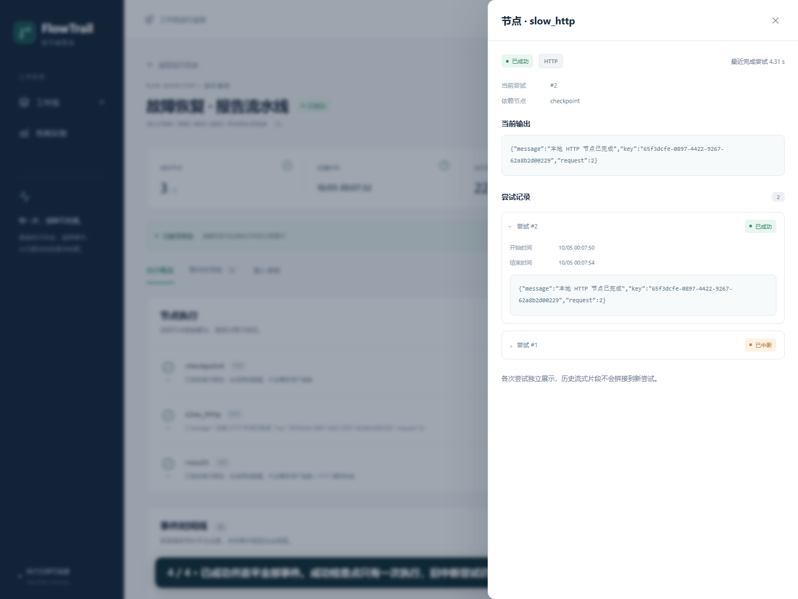

# 真实进程故障恢复 / Real process recovery

[恢复录像：recovery.mp4](demo/recovery.mp4) · [机器可读证据](demo/recovery-evidence.json)

录像来自包含 React 生产资源的实际 JAR 页面，使用合成输入和隔离 H2 数据库。脚本强制终止自己启动的 Java 进程，保留同一数据库重启；这是一段受控真实故障演示。

## 观察结果

1. `checkpoint` TEXT 节点成功，提交检查点；`slow_http` GET 节点在本地门控 HTTP 服务中等待。
2. 强杀隔离 Java，浏览器连接进入重试，保留最后确认的快照及连续游标。
3. 同一数据库重启，租约过期后执行器自动恢复；原 HTTP 尝试记为 `INTERRUPTED`，新尝试为 #2，成功检查点仍为 #1。
4. 释放 HTTP 门控后运行成功，浏览器追平最新终态水位。节点抽屉可同时查看中断尝试与成功尝试。

证据 JSON 保存前后 Run、事件及不同进程 PID；生成脚本实际断言检查点只有一次尝试、HTTP `[1, INTERRUPTED] → [2, SUCCEEDED]`、事件序号从 1 连续至 `lastEventSeq`，并等待页面追平终态。



## 复现

需要 Node 24.15+、Java 21、Maven、Chromium，以及 PATH 中的 FFmpeg（仅录像转码需要）。先关闭自己正在使用的演示服务，确保 4173、18081–18083 空闲；脚本遇占用会退出，不接管其他进程。

```sh
npm ci --legacy-peer-deps
npm run build:all
npx playwright install chromium
npm run demo:record
```

可用 `FLOWTRAIL_FFMPEG` 指定 FFmpeg 可执行文件。`demo:record` 在 `artifacts/local/recording/` 生成原始 WebM，在 `docs/demo/` 生成 MP4/证据，在 `docs/images/` 生成实际截图。字幕仅解释已经发生的动作；录像没有用假状态或剪辑冒充故障。

只验证恢复、不需要 FFmpeg 或重新生成公开素材时：

```sh
npm run test:e2e -- --grep "real Java process crash"
```

测试自动启动独立栈，结构化证据附于 Playwright 报告。Ctrl+C 或测试退出时关闭自有服务；隔离数据库留在系统临时目录中供本地排查，不进入 Git。

## 手动体验与边界

`npm run dev` → 创建“故障恢复”模板 → 提交合成输入 → 观察节点与时间线。该模板使用 8 秒的本地 HTTP 延迟，方便观察；完整进程强杀应使用上述隔离脚本。传输断线可用浏览器离线模式，或点击“停止监听”再“继续监听”；后端业务会继续执行。

自动重启恢复与“恢复执行”按钮不同：前者是持久化执行器重新领取过期租约，后者用于符合条件的失败终态。有效租约仍拒绝并发恢复。未知外部写入需要核查，本版本的按钮不会绕过 `MANUAL_REVIEW`；演示选用只读 GET，不能据此声称所有外部写入都能安全重试。

English: The video records a real, forcibly terminated Java process and a restart against the same isolated database, observed through the packaged production console. The generator verifies one checkpoint attempt, an interrupted HTTP attempt followed by a successful second attempt, contiguous events and terminal-watermark consumption. Local synthetic data and a gate-controlled read-only HTTP call keep the demonstration reproducible. This does not imply arbitrary external writes can be replayed safely.
